<!-- markdownlint-disable MD029 MD033 MD041 -->
<!-- PROJECT SHIELDS -->
[](https://github.com/RustyServerless/yak-mania/blob/master/LICENSE)

<div align="center">
  <a href="https://github.com/RustyServerless/yak-mania">
    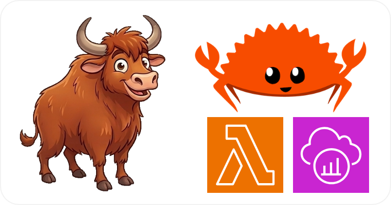
  </a>

  <h1>Yak Mania</h1>
  <p>
    A multiplayer yak-herding game built on AWS, showcasing the <a href="https://github.com/RustyServerless/awssdk-instrumentation"><code>awssdk-instrumentation</code></a> crate for zero-boilerplate OpenTelemetry/X-Ray tracing of Rust Lambda functions
    <br />
    <a href="#about-the-project"><strong>Learn More »</strong></a>
  </p>
</div>

This project is a reference architecture that demonstrates:

- **[`awssdk-instrumentation`](https://github.com/RustyServerless/awssdk-instrumentation)** — Out-of-the-box OpenTelemetry/X-Ray instrumentation for the AWS SDK for Rust, with first-class Lambda support. Used in the main AppSync Lambda and showcased in a dedicated [tracing comparison demo](#tracing-demo).
- **[`lambda-appsync`](https://github.com/RustyServerless/lambda-appsync)** — A type-safe framework that reads a GraphQL schema at compile time and generates operation routing, type definitions, and Lambda handler boilerplate. Used in the main AppSync Lambda.
- **Rust on AWS Lambda** — Compiled Rust binaries running on ARM64 (Graviton2) custom runtimes (`provided.al2023`), demonstrating performance and cost advantages.
- **AWS CI/CD** — A complete CodePipeline deploying infrastructure and a static website from a GitHub repo, with incremental Rust build caching.

👉 See also [**benchmark-game**](https://github.com/RustyServerless/benchmark-game), a companion project from the same organization that showcases `lambda-appsync` through a real-time AppSync resolver benchmark.

<details>
  <summary>Table of Contents</summary>

- [About The Project](#about-the-project)
  - [AWS Architecture](#aws-architecture)
  - [Tech Stack](#tech-stack)
  - [Repository Structure](#repository-structure)
- [Tracing Demo](#tracing-demo)
- [Getting Started](#getting-started)
  - [Prerequisites](#prerequisites)
  - [Deployment (quick)](#deployment-quick)
  - [Deployment (detailed)](#deployment-detailed)
  - [Cleanup](#cleanup)
- [Usage](#usage)
  - [Web Interface](#web-interface)
  - [Load Testing](#load-testing)
  - [Game Mechanics](#game-mechanics)
  - [Monitoring Results](#monitoring-results)
- [Development](#development)
  - [Requirements](#requirements)
  - [Local Testing](#local-testing)
- [License](#license)
- [Contact](#contact)

</details>

## About The Project

### AWS Architecture

<div align="center">
    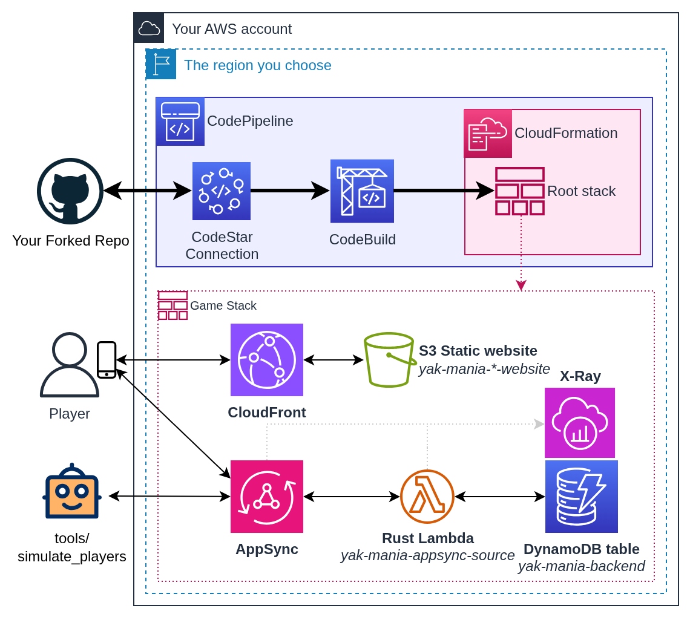
    <p><i>This PNG can be edited using <a href="https://draw.io">Draw.io</a></i></p>
</div>

Core Components:

- **CloudFront** distribution hosting the SvelteKit static website
- **AppSync** GraphQL API with Direct Lambda Resolver and batching (`MaxBatchSize=100`)
- **Rust Lambda** on ARM64 (`provided.al2023`) using `lambda-appsync` for type-safe schema-driven dispatch and `awssdk-instrumentation` for transparent X-Ray tracing
- **DynamoDB** single-table design (PK/SK composite key, `_TYPE` GSI)
- **Cognito User Pool** handling admin authentication (JWT)
- **API Key** enabling player authentication
- **X-Ray + OpenTelemetry** observability via `awssdk-instrumentation`
- **CodePipeline V2** → CodeBuild (ARM64) → CloudFormation (SAM) for CI/CD

### Tech Stack

| Layer | Technology |
|---|---|
| Frontend | SvelteKit static site (Svelte 5 + TailwindCSS v4 + DaisyUI v5), served via CloudFront + S3 |
| Auth | Cognito User Pools (admin JWT) + AppSync API Key (players) |
| API | AWS AppSync (GraphQL), Direct Lambda Resolver with batching |
| Backend Lambda | Rust on ARM64, using [`lambda-appsync`](https://github.com/RustyServerless/lambda-appsync) for type-safe dispatch |
| Database | DynamoDB single-table design |
| Observability | X-Ray + OpenTelemetry via [`awssdk-instrumentation`](https://github.com/RustyServerless/awssdk-instrumentation) |
| CI/CD | CodePipeline V2 → CodeBuild (ARM64) → CloudFormation (SAM) |
| IaC | CloudFormation with SAM transform + `AWS::LanguageExtensions` (`Fn::ForEach`) |

### Repository Structure

```
root-template.yml              # Root CF stack orchestrating 4 nested stacks
ci-template.yml                # CI/CD: CodePipeline, CodeBuild, IAM, custom resource
templates/
  graphqlapi.yml               # AppSync API, Rust Lambda, DynamoDB, resolvers, X-Ray
  cognito.yml                  # Cognito User Pool, OAuth client, admin group
  static-website.yml           # S3 + CloudFront + security headers + cleanup Lambda
  tracing-demo.yml             # 6-path tracing comparison (4 Python + 2 Rust)
graphql/
  schema.gql                   # GraphQL schema (read at compile time by lambda-appsync)
rust/lambdas/
  appsync-source/              # Main Lambda: all AppSync resolvers
  no-instrumentation-demo/     # Baseline Rust Lambda (manual boilerplate, no OTel)
  instrumentation-demo/        # Same handler + make_lambda_runtime! (replaces ~30 lines)
python/lambdas/
  no-instrumentation-demo/     # Python baseline (no instrumentation)
  xray-sdk-demo/               # Python + classic aws-xray-sdk patching
  adot-demo/                   # Python + ADOT (OTel collector)
  cleanup-s3/                  # S3 bucket emptier for stack cleanup
ci-config/
  buildspec.yml                # Rust incremental build with dependency-aware cache cleaning
website/
  buildspec.yml                # SvelteKit build injecting CF outputs as Vite env vars
tools/
  simulate_players/            # Load testing tool (Rust CLI)
  publish_tracing_demo.py      # SNS publish script for the tracing demo
local_testing/                 # Local integration test stack (DynamoDB Local + cargo-lambda)
```

## Tracing Demo


<div align="center">
    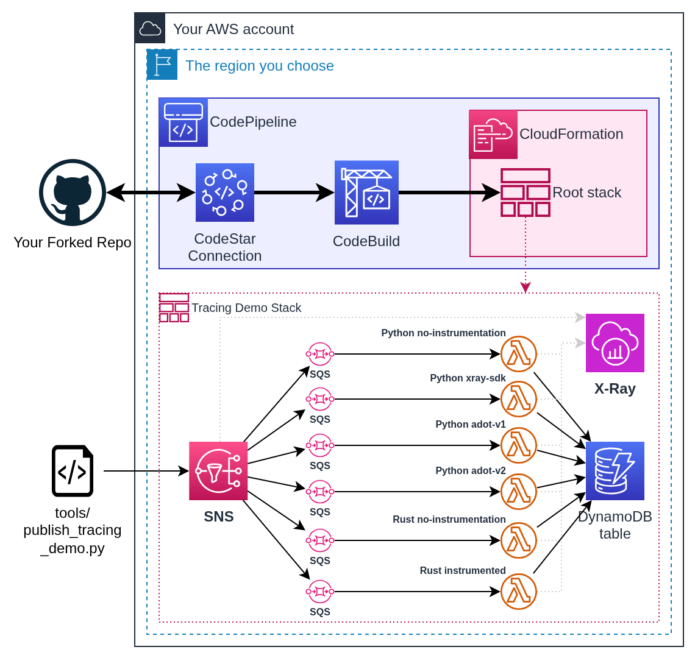
    <p><i>This PNG can be edited using <a href="https://draw.io">Draw.io</a></i></p>
</div>

A dedicated sub-stack (`templates/tracing-demo.yml`) deploys a side-by-side comparison of 6 different Lambda instrumentation approaches. An SNS topic fans out to 6 SQS queues, each triggering a Lambda with a different tracing strategy:

| # | Runtime | Instrumentation | Description |
|---|---------|-----------------|-------------|
| 0 | Python | None | Baseline — no tracing overhead |
| 1 | Python | X-Ray SDK | Classic `aws-xray-sdk` patching + X-Ray daemon |
| 2 | Python | ADOT v1 | OTel patching + OTel collector sidecar layer |
| 3 | Python | ADOT v2 | In-code X-Ray segment translation + X-Ray daemon |
| 4 | Rust | None | Baseline — manual boilerplate (~96 lines) |
| 5 | Rust | `awssdk-instrumentation` | tracing instrumentation + OTel + X-Ray daemon |

Each Lambda writes to the same DynamoDB table to prove it processed the message. The comparison highlights cold start overhead and trace quality across approaches.

The key takeaway is in the Rust pair: the handler code in `no-instrumentation-demo` and `instrumentation-demo` is **identical** — instrumentation is completely transparent to business logic. The only difference is that `make_lambda_runtime!` replaces ~30 lines of manual boilerplate (tracing subscriber, SDK config, client initialization, Lambda runtime setup) with a single macro invocation:

```rust
// no-instrumentation-demo: ~30 lines of manual setup
static AWS_SDK_CONFIG: OnceLock<::aws_config::SdkConfig> = OnceLock::new();
fn aws_sdk_config() -> &'static ::aws_config::SdkConfig { /* ... */ }
async fn sdk_config_init() { /* ... */ }
fn dynamodb() -> dynamodb_facade::Client { /* ... */ }

#[tokio::main]
async fn main() -> Result<(), lambda_runtime::Error> {
    tracing_subscriber::fmt().json()
        .with_env_filter(EnvFilter::from_default_env())
        .with_current_span(false)
        .with_ansi(false)
        .with_target(false)
        .init();
    sdk_config_init().await;
    lambda_runtime::Runtime::new(lambda_runtime::service_fn(handler))
        .run()
        .await
}
```

```rust
// instrumentation-demo: one macro replaces all of the above
awssdk_instrumentation::make_lambda_runtime!(
    handler,
    trigger = OTelFaasTrigger::PubSub,
    dynamodb() -> dynamodb_facade::Client
);
```

To trigger the demo, publish a message to the SNS topic using the provided script:

```bash
# Export you ACCESS_KEY/SECRET_KEY or otherwise configure your AWS API authentication
python tools/publish_tracing_demo.py <topic_arn>
```

Then inspect the resulting traces in the X-Ray console to compare cold start overhead, trace depth, and annotation quality across all 6 approaches.

## Getting Started

### Prerequisites

1. An AWS account with permissions for:
   - AWS CodeStar Connections
   - AWS CloudFormation
   - AWS CodePipeline
   - Amazon S3
   - AWS CodeBuild
   - AWS Lambda
   - Amazon AppSync
   - Amazon DynamoDB
   - AWS IAM
   - Amazon Cognito
   - Amazon CloudFront
   - Amazon SNS
   - Amazon SQS
   - Amazon X-Ray

2. A GitHub account to fork the repository

### Deployment (quick)

1. Fork this repository to your GitHub account
2. Create a CodeStar connection to GitHub:
   - Go to CodePipeline console > Settings > Connections
   - Choose GitHub provider and follow the authorization process
   - Copy the connection ARN
3. Deploy the CI template:

   ```bash
   aws cloudformation create-stack \
     --stack-name yak-mania-ci \
     --template-body file://ci-template.yml \
     --parameters \
       ParameterKey=ProjectName,ParameterValue=yak-mania \
       ParameterKey=CodeStarConnectionArn,ParameterValue=YOUR_CONNECTION_ARN \
       ParameterKey=ForkedRepoId,ParameterValue=YOUR_GITHUB_USERNAME/yak-mania \
       --capabilities CAPABILITY_NAMED_IAM CAPABILITY_AUTO_EXPAND
   ```

4. Wait for the pipeline to complete (~30 minutes)

### Deployment (detailed)

#### 1. Fork the repo

Fork this repository in your own GitHub account. Copy the ID of the new repository (\<UserName>/yak-mania), you will need it later. Be mindful of the case.

The simplest technique is to copy it from the browser URL:

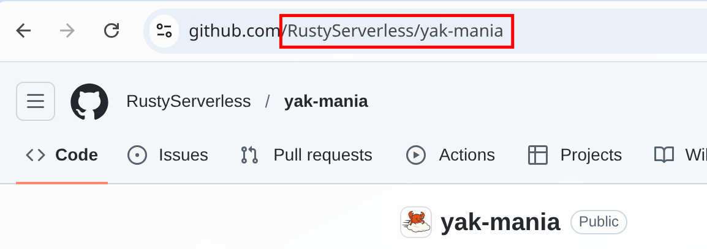

#### Important

In the following instructions, there is an *implicit* instruction to **always ensure your AWS Console
is set on the AWS Region you intend to use**. You can use any region you like, just stick to it.

#### 2. Create a CodeStar connection to your GitHub account

This step is only necessary if you don't already have a CodeStar Connection to your GitHub account. If you do, you can reuse it: just retrieve its ARN and keep it on hand.

1. Go to the CodePipeline console, select Settings > Connections, use the GitHub provider, choose any name you like, click Connect to GitHub

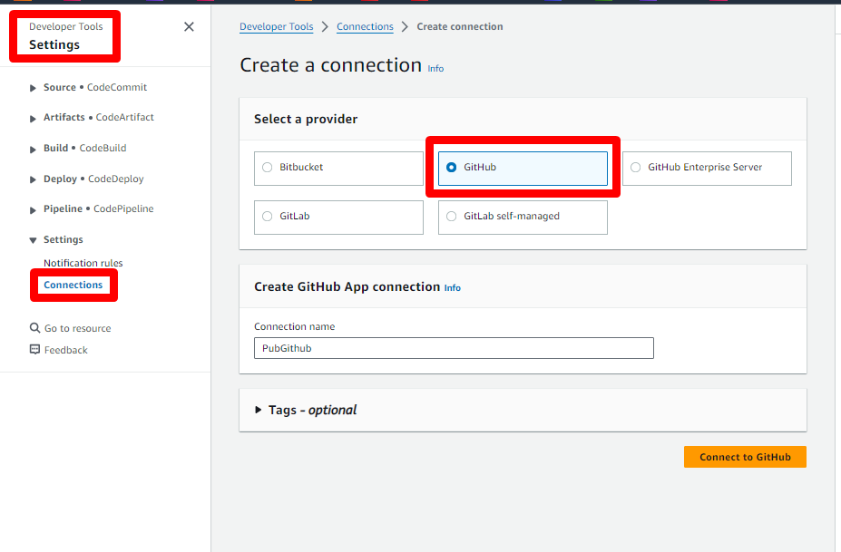

2. Assuming you were already logged-in on GitHub, it will ask you if you consent to let AWS do stuff in your GitHub account. Yes you do.

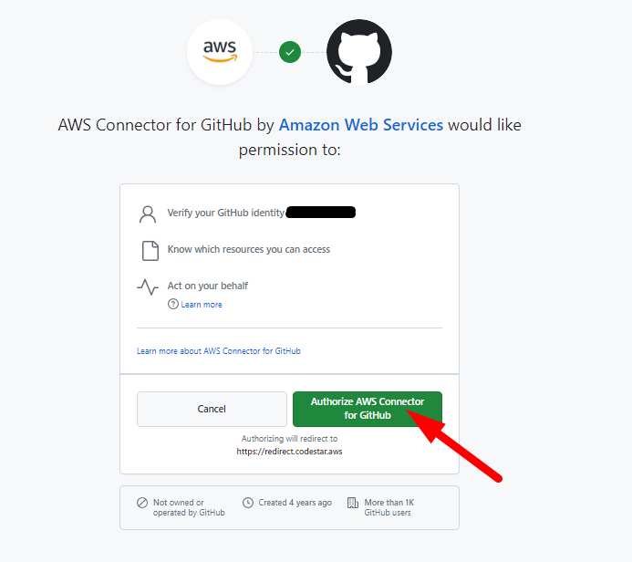

3. You will be brought back to the AWS Console. Choose the GitHub Apps that was created for you in the list (don't mind the actual number on the screenshot, yours will be different), then click Connect.

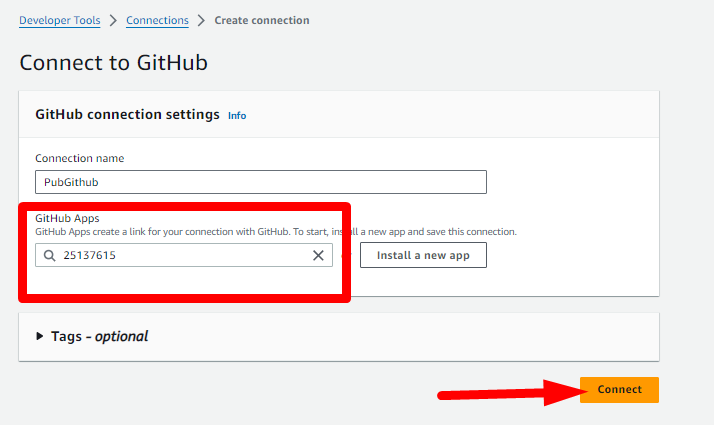

4. The connection is now created, copy its ARN somewhere, you will need it later.

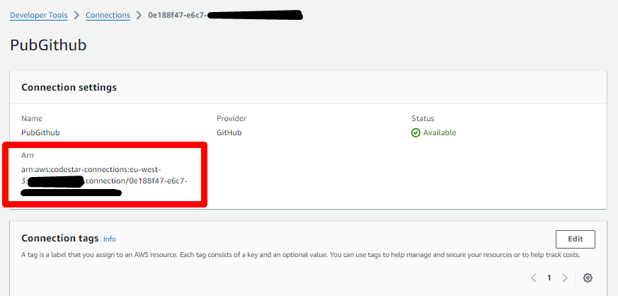

### Deployment

Now you are ready to deploy, download the CloudFormation template [ci-template.yml](https://github.com/RustyServerless/yak-mania/blob/master/ci-template.yml)
from the link or from your newly forked repository if you prefer.

5. Go to the CloudFormation console and create a new stack.

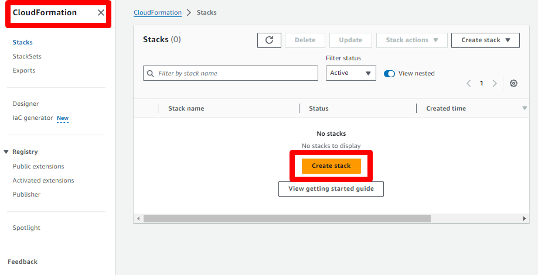

6. Ensure *Template is ready* is selected and *Upload a template file*, then specify the `ci-template.yml` template that you just downloaded.

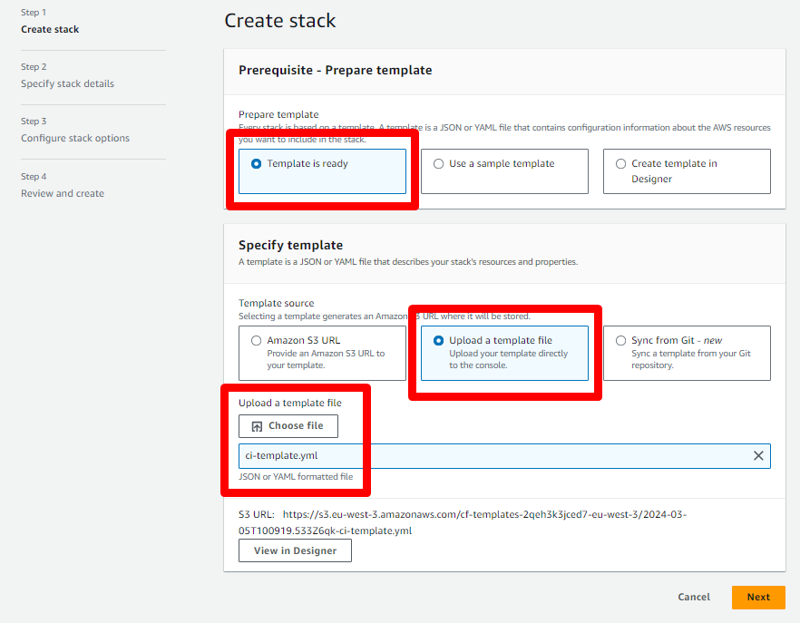

7. Choose any Stack name you like, set your CodeStar Connection Arn (previously copied) in `CodeStarConnectionArn` and your forked repository ID in `ForkedRepoId`

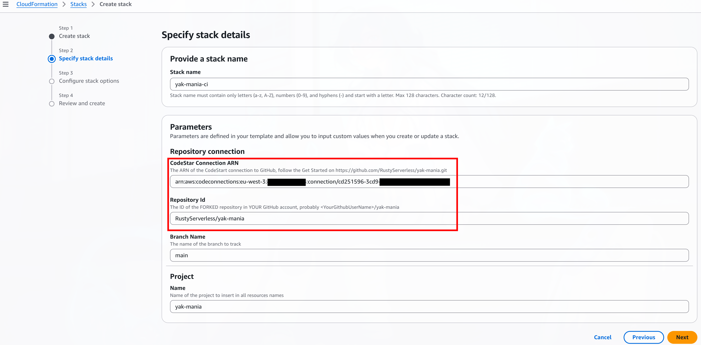

8. Skip the *Configure stack options*, leaving everything unchanged

9. At the *Review and create* stage, acknowledge that CloudFormation will create roles and Submit.

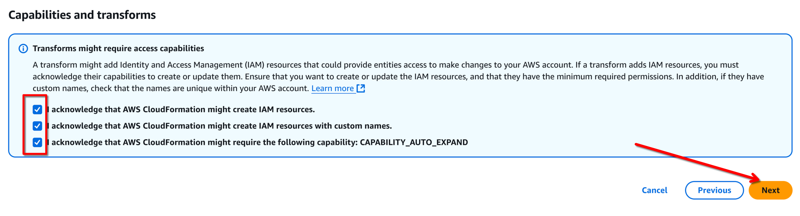

At this point, everything will roll on its own, the full deployment should take ~30 minutes, largely due to the quite long first compilation of Rust lambdas and the very long deployment time of CloudFront.

If you wish to follow what is happening, keep the CloudFormation tab open in your browser and open another one on the CodePipeline console.

### Cleanup

⚠️ **IMPORTANT**: The stacks must be deleted in a specific order due to IAM role dependencies:

1. `yak-mania-root` - ⏳ Wait for status **DELETE_COMPLETE** - This stack uses an IAM role created by the CI stack
2. `yak-mania-ci` - This stack owns the IAM role used by the first for its operations.

🚨 **PLEASE READ**: Do not attempt to delete both stacks simultaneously, as this **WILL** cause failures that are difficult to resolve. You must wait for the first stack (Yak Mania Game/Demo) to **COMPLETELY** finish deleting before starting deletion of the second stack (CI stack). One of the IAM roles of the `yak-mania-ci` stack is used for the operations of the `yak-mania-root` stack.

## Usage

### Web Interface

Once deployed:

1. Create an admin user in Cognito:
   - Go to the Cognito console
   - Select the user pool created by the stack
   - Create a new user with your email
   - Add the user to the "Admins" group
2. Access the game through the CloudFront URL provided in the stack outputs:
   - Register as a player to be assigned to a team
   - Access the admin interface by navigating to /admin in your browser
   - Use your admin account to start a game round
   - Pick a job (Breeder, Driver, or Shearer) and start herding yaks!
   - Watch the real-time dashboard at /admin/dashboard

### Load Testing

The `tools/simulate_players/` directory contains a Rust CLI tool for generating synthetic load against the deployed game.

First compile the simulation tool:

```bash
cd tools/simulate_players
cargo build --release
```

The optimized binary will be available at `target/release/simulate_players`. You can copy it to any desired location.

Then use the simulation tool to generate synthetic load:

```bash
# Register simulated players
./simulate_players \
  --api-endpoint "YOUR_APPSYNC_URL" \
  --api-key "YOUR_API_KEY" \
  --players 100 \
  --register-only

# Run simulation
./simulate_players \
  --api-endpoint "YOUR_APPSYNC_URL" \
  --api-key "YOUR_API_KEY" \
  --players 100
```

### Game Mechanics

Players join a yak-herding economy where yaks flow through a pipeline of jobs:

**Breeder** (creates baby yaks) → **Warehouse** → **Driver** (transports yaks) → **Shearing Shed** → **Shearer** (shears yaks, which are then removed)

Players pick jobs, buy and sell yaks at each stage, and earn fees for their work. A dynamic fee system compares the actual vs. ideal yak distribution across the pipeline to incentivize players toward underpopulated jobs — if too few drivers are moving yaks, driving fees go up.

The game state machine enforces transitions atomically via DynamoDB conditional expressions:

```
Reset → Started → Stopped → Reset
```

Admins control the game lifecycle (start/stop/reset) through a Cognito-authenticated admin panel, while players interact through an API-key-authenticated mobile-first game view with real-time updates via AppSync subscriptions.

### Monitoring Results

Monitor performance through multiple tools:

1. **AppSync Console** > Monitoring tab
   - Real-time resolver latency metrics
   - Error rates and types
   - Active connections count
   - Request counts by resolver

2. **CloudWatch Metrics** for AppSync resolvers
   - Navigate to CloudWatch > Metrics > AppSync
   - View resolver-specific metrics like latency percentiles, error counts, throttled requests

3. **CloudWatch Logs Insights** for detailed execution analysis
   - Navigate to CloudWatch > Logs > Logs Insights
   - Select log groups under `/aws/lambda/yak-mania-*`
   - Use AWS's example query for Lambda analysis

4. **AWS X-Ray traces**
   - Access via AppSync Console > Monitoring > Traces
   - Or navigate to X-Ray Console > Service map
   - View end-to-end request flow
   - Analyze resolver timing breakdowns
   - Identify bottlenecks in the request chain
   - Compare instrumented vs. non-instrumented Lambda traces from the [tracing demo](#tracing-demo)

## Development

### Requirements

- Rust 1.85+ with `cargo-lambda`
- Node.js 24+
- Python 3.12+
- Java 21+ JRE for DynamoDB Local

All tools are provided by the Nix flake (`nix/flake.nix`). If you're not using Nix, install manually:

```bash
# Install Rust
curl --proto '=https' --tlsv1.2 -sSf https://sh.rustup.rs | sh
rustup default 1.85
# Install cargo-lambda to be able to run lambda locally
cargo install cargo-lambda

# Install Node.js dependencies (assuming you already have npm)
cd website
npm install

# Install Python dependencies (assuming you already have Python/Pip)
pip install boto3
```

### Local Testing

The [`local_testing/`](local_testing/) directory contains a complete local integration test stack. It runs DynamoDB Local, the Lambda, and a 29-step scenario exercising the full game lifecycle — no AWS account required.

See the [local testing README](local_testing/README.md) for setup and usage instructions.

## License

Distributed under the MIT License. See [`LICENSE`](LICENSE) for more information.

## Contact

Jérémie RODON ([@JeremieRodon](https://github.com/JeremieRodon)) [](https://linkedin.com/in/JeremieRodon) — [RustyServerless](https://github.com/RustyServerless) [rustysl.com](https://rustysl.com/index.html?from=github-lambda-appsync)

Project Link: [https://github.com/RustyServerless/yak-mania](https://github.com/RustyServerless/yak-mania)
